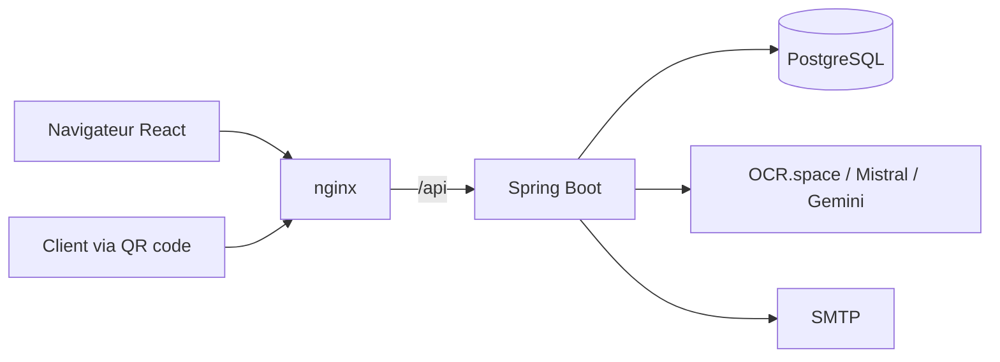

# InkScribe AI


Plateforme d'analyse d'avis clients : lecture d'avis **manuscrits** par OCR, analyse
de sentiment, thèmes et mots-clés par IA, collecte par **QR code**, tableau de bord.

[Démo en ligne](https://...) · 

## Fonctionnalités

- Import de photos d'avis manuscrits, OCR (OCR.space, Mistral, Gemini) puis analyse IA
- Formulaire public par établissement, accessible par QR code, analysé automatiquement
- Sentiment, thèmes, mots-clés positifs et négatifs, réponse client suggérée
- Tableau de bord : tendances, alertes sur le taux d'avis négatifs, détection de doublons
- Import / export CSV et JSON, comptes multi-établissements

## Architecture



| Couche | Technologies |
|---|---|
| Frontend | React, TypeScript, Vite, Material Web |
| Backend | Java 21, Spring Boot 4, Spring Security, JPA |
| Données | PostgreSQL (jsonb pour listes et objets) |
| Déploiement | Docker Compose, nginx, Caddy (HTTPS) |

## Sécurité

- Mots de passe hachés avec BCrypt, jetons JWT signés (HS256), API stateless
- Vérification d'e-mail, réinitialisation de mot de passe par code à usage unique
- 2FA TOTP (RFC 6238), secret chiffré en base, code non rejouable
- Blocage du compte après 5 échecs, limitation de débit par IP
- Clés API des services IA stockées chiffrées (AES-256-GCM), jamais renvoyées au navigateur
- Isolation stricte des données entre comptes (vérifiée par des tests)

## Tests

24 tests automatisés, exécutés par GitHub Actions :

- Unitaires : TOTP contre les vecteurs officiels de la RFC 6238, chiffrement, limitation de débit
- Intégration sur un vrai PostgreSQL : inscription, vérification d'e-mail, blocage, isolation des comptes, 2FA, formulaire public, chiffrement des clés

```bash
cd backend && ./mvnw test
```

## Lancer le projet

```bash
cp .env.example .env     # remplir les secrets
docker compose up --build
```

Ouvrir http://localhost:8081. Sans SMTP configuré, les codes e-mail s'affichent dans
`docker compose logs backend`.

Développement : `./mvnw spring-boot:run` dans `backend`, `npm run dev` dans `frontend`.

## Limites connues et pistes

- Schéma géré par Hibernate (`ddl-auto=update`) : passer à Flyway
- Images stockées en base64 dans la table : à déplacer vers un stockage objet
- Pas de pagination de la liste d'avis, limitation de débit en mémoire
- Pas de codes de secours 2FA
- Prévu : digest hebdomadaire par le backend, évaluation chiffrée des OCR